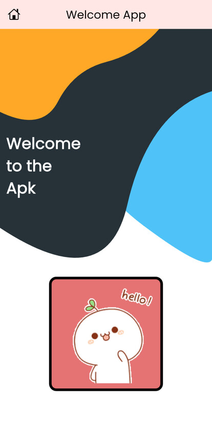
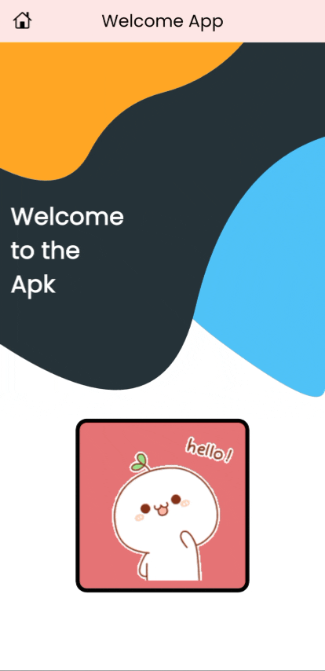

# Welcome App 🎉

A simple Flutter application that displays a modern **welcome screen** with a **custom-painted background** and an animated **hello GIF**.  


## ✨ Features

- 🎨 Custom background with smooth Bezier curves drawn using `CustomPainter`.
- 🖼️ Animated welcome screen with a GIF loaded via `cached_network_image`.
- 📱 Responsive layout using `Column`, `Spacer`, and alignment.
- 🖋️ Modern typography with Google Fonts (Poppins).
- 🧑‍💻 Clean and modular codebase.


## 📂 Project Structure

```plaintext
lib/
├── main.dart              # Entry point of the app
├── home.dart              # Home screen widget
└── background_painter.dart # Custom painter for background design
```

## 🛠️ Built With

- [Flutter](https://flutter.dev/) - UI toolkit for building cross-platform apps  
- [Dart](https://dart.dev/) - Programming language used with Flutter  
- [cached_network_image](https://pub.dev/packages/cached_network_image) - Efficient image caching and loading  
- [google_fonts](https://pub.dev/packages/google_fonts) - Access to modern fonts for a stylish UI  


## 📸 App Preview

| Screenshot | Animated Demo |
|------------|---------------|
|  |  |
